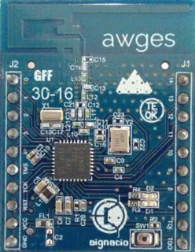
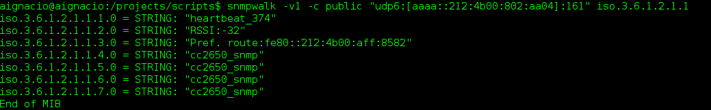
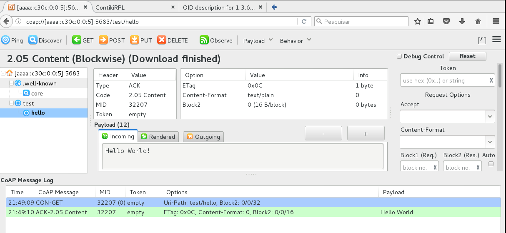

#Dispositivo HomeStark 6LoWPAN Network


__Desenvolvedor:__ Ânderson Ignácio da Silva

Projeto de TCC para criação de uma rede mesh 6LoWPAN gerenciável utilizando
protocolos de gerenciamento e dados de redes IP. O Target alvo utilizado é o
CC2650 da Texas Instruments, porém com pequenas adaptações também funciona em
outros dispositivos. O dispositivo implementado é capaz de se conectar a uma
rede mesh 6LoWPAN, comunicando via CoAP ou MQTT-SN com broker através de uma
interface de gestão/configuração. Também é possível gerenciar a rede mesh
 através do protocolo SNMPv1 também implementado.</br>
</br>
__Características:__
- [x] Protocolo MQTT-SN
- [x] Protocolo CoAP
- [x] Agent SNMPv1
- [x] Documentação em Doxygen

##Implementação:
```make
>make TARGET=srf06-cc26xx
>make TARGET=z1
```
A implementação do projeto foi realizada utilizando o dispositivo z1-zolertia em simulações
com a ferramenta cooja porém, em função de limites de memória ROM do cross-toolchain
(msp-gcc), deve-se utilizar o compilador em anexo na pasta <b>tools</b>, onde também
há um shell script de instalação do mesmo. Outro detalhe em relação as simulações são os critérios de memória RAM do z1, a qual limita a utilização de apenas umas das características de protocolos utilizados (mqtt, coap, snmp). Diferentemente da simulação, todas os protocolos
podem ser utilizados caso do Target alvo seja o CC2650.

##SNMPv1:
A implementação do agente SNMP se limita apenas a versão 1 do protocolo onde algumas OIDs da MIB2 são implementadas, no arquivo main_core.c estão as inicializações e descrições de OIDs utilizadas. Como não há definição de MIB para a rede RPL, foram utilizadas OIDs disponíveis de informações do host. O teste do protocolo SNMP foi realizado utilizando o programa para Linux
net-snmp com comandos de <b>snmpget</b> e <b>snmpwalk</b>, uma vez que o dispositivo responde
a requisições get e get-next. Uma característica é de que o dispositivo responde ao walk somente
na OID master da requisição, logo:</br>
requisição:</br>
snmpget .... iso.3.6.1.2.1.1</br>
resposta:</br>
iso.3.6.1.2.1.1.1 = ...</br>
iso.3.6.1.2.1.1.2 = ...</br>
iso.3.6.1.2.1.1.3 = ...</br>
...
Esta característica evita o overhead possível de ser gerado em uma requisição deste tipo. O protocolo SNMP é utilizado somente para gerenciamento da rede RPL os quais fornecem a interface um meio de montar a topologia da rede. Um exemplo de requisição/resposta real pode ser visto abaixo:
</br>

##CoAP:
A implementação do CoAP fornece acesso a periféricos e ações dos dispositivos para troca de dados, todas os recursos estão contidos na pasta <b>resources</b>. O modo de servidor CoAP é
executado no dispositivo que responde as requisições restfull conforme soliticações de clientes.
Para teste do protocolo recomenda-se a utilização do plugin copper para o firefox, o qual além de ser capaz de descobrir recursos, fornece ferramentas para diferentes tipos de requisições.
</br>

##MQTT-SN:
A implementação do MQTT-SN já está contida nesse repositório:
[MQTT-SN](https://github.com/aignacio/MQTT-SN-Contiki---HomeStark)

##Observações
Se o CC2650 utilizado for o launchpad, ele pode apresentar erro na programação com o Uniflash Tool, tal problema relacionado com o programador JTAG anexado a placa, para resolver isso, conecte o launchpad a um Windows com o software SmartRF Flash Programmer v2 e clique em "update" que após o update da ferramenta, ele irá ser programado no Linux.
Toda documentação das funções está em doxygen no caminho ./doxy_files/html/index.html.

##Contribuições e licença:
Este software está sendo liberado sobre a licença Apache 2.0, qualquer contribuição deve ser informada ao autor, criando um branch novo para o feature implementado.

##Nomenclaturas adicionais:

ETX (expected transmission count) = Medidor de qualidade de caminho
entre dois nós em um pacote wireless de rede. Basicamente esse núme
ro indica o número esperado de transmissões de um pacote necessária
s para que não haja erro na recepção no destino.
